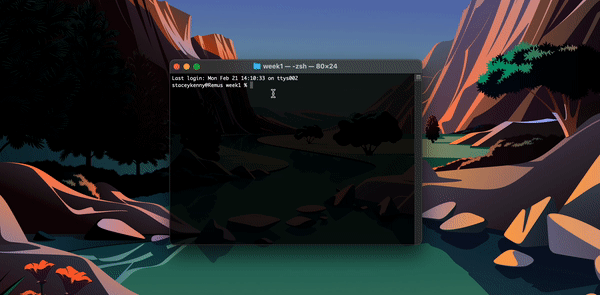

# foundations-spring2022-se Task 1
## CODE University Foundations: SE_01 Week 1 Task

Simple number comparison game for weekly assessment.

### Task Requirements:
- The game starts by asking the user to pick a number between 1 and 100.
- Then, the computer generates a random number between 1 and 100. (For this step, you'll have to do some research on how to generate a random number in Python. You'll likely get to know a new keyword "import" that you haven't learned about yet. Don't worry too much if you don't understand it yet. We'll learn more about imports in the upcoming sessions)
- Now, compare those two numbers. The higher number wins. The same numbers are a tie. (For this step you'll likely run into error messages. Take some time trying to understand the error.)
- Return a different message to the user based on the outcome of the game. 
- Bonus: Use functions to allow the user to repeat the game.

###### Made with Python
